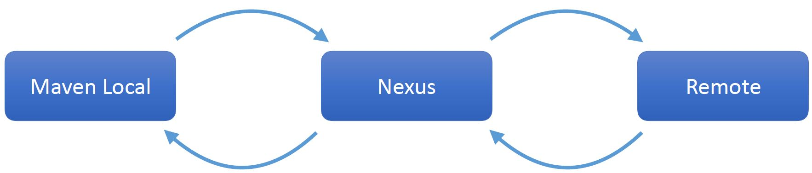
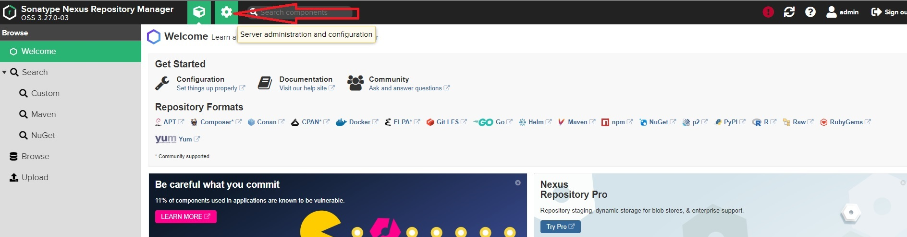

# javac, java, ClassPath MEMO

```java
package mp;

public class HelloWorld {

    public static void main(String[] args) {
        System.out.println("Hello, World");
    }

}
```

```sh
#package mp/*.java files, mp should be also a folder  because 
#it's a class package (mp = my package)

javac  .\mp\*.java


# need to specify a classpath (e.g. '.' ) and fully 
# qualified class name (packageName.ClassName)
java -cp . mp.HelloWorld
>> output: Hello, World


#create a test.jar file in win 10 using jdk-11.0.8
#'C:\Program Files\Java\jdk-11.0.8\bin\jar.exe' -cf test.jar mp/*.class

#run the jar file
java -cp test.jar  mp.HelloWorld

```
-----
# Maven


###### shows the dependency tree. Useful for resolving conflicts
 ``` 
 mvn dependency:tree
 ```

###### Resolve all, prepare to go offline
 ```
 mvn dependency:go-offline
 ```

###### Clear artifacts from local repository
 ```
 mvn dependency:purge-local-repository
 ```

###### get sources for all dependencies.
 ```
 mvn dependency:sources 
 ```
---
# Maven Build Lifecycles
Maven is based on the concept of build lifecycles :
- A lifecycle is a **pre-defined group** of **build steps** called **phases**
- Each **phase** can be **bound** to one or more **plugin goals**
- Keep in mind all **work** done in **Maven** is done by **plugins!**
- **Lifecycles** and **phases** provide the **framework** to call **plugin goals** in a **sequence**

Maven has _three_ **pre-defined lifecycles**: 
- **clean** : Does a clean of the project, **removes** all **build artifacts** from **working directory**, Defined with **plugin bindings**.
- **default** : Does the **build and deployment** of project, Defined without **plugin bindings**, **bindings** are *defined* for each **packaging**.
- **site**: 
	- Creates the a **website** for the project, Defined with **plugin bindings**.
	- **Least** used in the enterprise.
	- **Maven websites** are all **built** using the **Maven** **site lifecycle**.
	

**_Default Lifecycle - High-level_**
-
- **Validate** : Verify project is correct.
- **Compile** : Compile Source Code.
- **Test** : Test Compiled Source Code.
- **Package** : Package compiled files to packaging type.
- **Verify** : Run Integration Tests.
- **Install** : Install to local Maven Repository.
- **Deploy** : Deploy to shared Maven Repository.

**_Default Lifecycle All Phases_:**

*Validate*, *Initialize*, *Generate Sources*, *Process Sources*, *Generate Resources*, *Process Resources*, *Compile*, *Process Classes*, *Generate Test Sources*, *Process Test Sources*, *Generate Test Resources*, *Process Test Resources*, *Test Compile*, *Process Test Classes*, *Test*, *Prepare Package*, *Package*, *Pre-Integration Test*, *Integration Test*, *Post Integration Test*, *Verify*, *Install*, *Deploy*.

_Default Lifecycle - JAR Packaging_
--
1-  **Phase**: process-resources - **Plugin**: `maven-resources-plugin : resources`.

2- **Phase**: compile - **Plugin**: `maven-compiler-plugin : compile`.

3- **Phase**: process-test-resources - **Plugin**: `maven-resources-plugin : testResources`.

4- **Phase**: test-compile - **Plugin**: `maven-compiler-plugin : testCompile`.

5- **Phase**: test - **Plugin**: `maven-surefire-plugin : test`

6- **Phase**: package - **Plugin**: `maven-jar-plugin : jar`

7- **Phase**: install - **Plugin**: `maven-install-plugin : install`

8- **Phase**: deploy - **Plugin**: `maven-deploy-plugin : deploy`


_Site Build Lifecycle_:
--
**Site Lifecycle Phases:**

1- Phase: Pre-site - Plugin: `none`

2- Phase: Site - Plugin: `maven-site-plugin : site`

3- Phase: Post-site - Plugin: `none`

4- Phase: Site-Deploy - Plugin: `maven-site-plugin : deploy`


Maven Wrapper
-----
- It a wrapper around maven without having to install maven in the local machine, **but we need to have Java installed instead**.
  - check if it's install : `mvn -version`
  - example of creating an takari wrapper `mvn -N io.takari:maven:wrapper` [more...](https://github.com/takari/maven-wrapper) 
  - run `.\mvnw -version` to get the maven wrapper version which might be different from installed version:
  
    - if we go to .mvn/wrapper/maven-wrapper.properties folder, we get infromartion about version also io.takari maven repository:

```
distributionUrl=https://repo.maven.apache.org/maven2/org/apache/maven/apache-maven/3.6.3/apache-maven-3.6.3-bin.zip
wrapperUrl=https://repo.maven.apache.org/maven2/io/takari/maven-wrapper/0.5.6/maven-wrapper-0.5.6.jar
```
  - **example of updating an takari wrapper** with an mvn target version 3.6.0 (be sure that you are in the project folder!) `mvn -N io.takari:maven:wrapper -Dmaven=3.6.0`
    
- Good habit is to distribute the project using wrapper.
- If we run a project without a wrapper either it will use the maven installed in the system if any or use the one from IDEA (intellij, eclipse,...).


Maven Archetypes
-----
- Maven Archetypes are project templates
- Archetype - *An original pattern or model from with all other things of the same kind are made.*
- Apache Maven provides a variety of standard archetypes to serve as starters for common Java
projects
- Maven Archetypes are also available from a variety of 3rd parties
- Some of the archetypes are getting rather outdated (i.e. J2EE 10 year ago, Apache Camel,...)

Example : `mvn archetype:generate -DarchetypeArtifactId=maven-archetype-archetype -DgroupId=groupId -DartifactId=asimio-api-archetype -DinteractiveMode=false
` [more...](https://maven.apache.org/archetypes/) 
>> in windows it works only in cmd and not in powershell.


# Maven Plugins

**Maven Clean Plugin**
---
- Build Lifecycle - CLEAN 
- Has only one goal - 'clean'
- Purpose is to remove files generated during build process.
- By default removes /target directory project root and submodule root folders


**In maven all phases of lifecycles are hooks around plugin which have plugin's default implementations per phases that we could also customized**

> for **initialize** phase we explicitly add the clean goal, thus all phase will run the goal clean since they have the initialize phase

```xml 
<build>
	<plugins>
		<plugin>
			<groupId>org.apache.maven.plugins</groupId>
			<artifactId>maven-clean-plugin</artifactId>
			<!--<version>3.1.0</version>-->
			<executions>
				<execution>				
					<id>my-auto-clean</id>
					<phase>initialize</phase>
					<goals>
						<goal>clean</goal>
					</goals>
				</execution>
			</executions>
		</plugin>
	</plugins>
</build>
```

>> output :
```
...
[INFO] --- maven-clean-plugin:2.5:clean (my-auto-clean) @ hello-world ---
[INFO] Deleting C:\Java-Examples\helloworld\target
..
```


**Maven Compiler Plugin** : Build Lifecycle - DEFAULT
---
- Has **two goals** : `compiler:compile`, `compiler:testCompile`
- By Default uses the compiler `javax.tools.JavaCompiler` out of JVM and which is the default compiler available within the JVM and not the `javac` we use in command line available also within the JVM!
- Can be **configured** to use `javac` if needed
- Default source and target language levels are `Java 1.6`
- Apache team encourages these values to be set

**Maven Resources Plugin** : Build Lifecycle - DEFAULT
---
- Has **3 goals**:  `resources:resources`, `resources:testResources`, `resources:copy-resources`
- Purpose is to **copy project resources** to output directory (**target dir**)
- Can be configured for encoding, **source and target directories**
- Rather versatile configuration options for **copying files** during **build processing**

Maven Surefire Plugin: Build Lifecycle - DEFAULT
----
- Has **1 goal**: `surefire:test`
- The **Surefire plugin** is used to **execute unit test** of the project.
- By default supports `JUnit 3`, `JUnit 4`, `JUnit 5`, and `TestNG`
- `Cucumber` runs under `JUnit`, `Spock` compiles to **JUnit byte code**.
- By default includes classes named: `**/Test*.java` ` **/*Test.java` `**/*Tests.java` `**/*TestCase.java`


**Maven jar plugin : Build Lifecycle - DEFAULT**
---
- Has **2 goals**: `jar:jar` and `jar:test-jar`
- **Purpose** is to **build jars** from **complied artifacts** and **project resources**
- Can be **configured** for **custom manifests**, and to **make** **executable jars**.
- e.g. used by **Springboot** out of the box.


  see ["Creating an Executable JAR File"](https://maven.apache.org/shared/maven-archiver/examples/classpath.html) 
    
 **pom.xml**
```xml 
 ...
  <plugin>
	<groupId>org.apache.maven.plugins</groupId>
	<artifactId>maven-jar-plugin</artifactId>
	<configuration>
		<archive>
			<manifest>
				<addClasspath>true</addClasspath>
				<mainClass>FullyQualifiedPackageName.HelloWorld</mainClass>
			</manifest>
		</archive>
	</configuration>
</plugin>
...
 ```
  

**Maven Deploy Plugin : Build Lifecycle - DEFAULT**
---
- Has **2 goals** : `deploy:deploy` and  `deploy:deploy-file`
- **Purpose** is to **deploy project artifacts** to **remote** **Maven repositories**
- Often done in **CI**
- **Configuration** is typically **part** of the Maven **POM**

  see ["Apache Maven Deploy Plugin"](https://maven.apache.org/plugins/maven-deploy-plugin/usage.html) 

 we could use different Apache wagon protocols for deployment : [https, ssh, ftp ](https://maven.apache.org/plugins/maven-deploy-plugin/project-deployment.html)
 
Maven Site Plugin : Build Lifecycle - SITE
----
It has **7 goals**
- `site:site` : Generate site for project
- `site:deploy` : Deploy site via Wagon
- `site:run` : Run Site **locally** using **Jetty** as **web server**
- `site:stage` : generate site to a local staging directory for testing
- `site:stage-deploy` : Deploy site to remote staging location for testing
- `site:attach-descriptor` : **adds site.xml** (site map file used by search engines) to files for **deployment**
- `site:jar` : **bundles site** into a jar for **deployment** to a Maven **repository**
- `site:effective-site` : generates the **site.xml** file


 
> Maven environment (maven 3.6.0) brings always [maven-site-plugin 3.3](https://stackoverflow.com/questions/51103120/why-does-maven-site-plugin-always-use-version-3-3), to fix this see the code snippet below : 

```xml 
 <plugin>
	<groupId>org.apache.maven.plugins</groupId>
	<artifactId>maven-site-plugin</artifactId>
	<version>3.7.1</version>
</plugin>
```
see https://maven.apache.org/ref/3.6.3/
and https://maven.apache.org/ref/3.6.3/maven-core/lifecycles.html in the **site Lifecycle** code snippet they bind to maven-site-plugin:3.3 instead of 3.7.1!
```xml 
<phases>
  <phase>pre-site</phase>
  <phase>site</phase>
  <phase>post-site</phase>
  <phase>site-deploy</phase>
</phases>
<default-phases>
  <site>
    org.apache.maven.plugins:maven-site-plugin:3.3:site
  </site>
  <site-deploy>
    org.apache.maven.plugins:maven-site-plugin:3.3:deploy
  </site-deploy>
</default-phases>
```
 
**Maven commands**
---

```
#mvn plugin: run all goal within the plugin!
mvn clean

#mvn plugin:goal
mvn clean:clean 

mvn validate

mvn test

#combine 2 lifecycles
mvn clean test

#install the jar's in .m2 local repository
mvn install

mvn dependency:tree

mvn help:effective-pom

mvn package -DTestskip

mvn clean dependency:copy-dependencies package


```
see [Maven in 5 Minutes](https://maven.apache.org/guides/getting-started/maven-in-five-minutes.html)

> when we run the package lifecycle maven create all sources in `target/generated-sources`, and then copies them to `target\classes`, and then zip them into a jar file in `target\status` (e.g. jaxb case).


**Lombok Project**
---
Project Lombok is a `code generator` which uses `annotation processing` to enhance classes, we can generate `getters, setters, toString, etc` from annotations at compile time.

> for intellij need to go: `Build, Execution, Deployment -> Compiler -> Annotation Processors` and then `Enable annotation processing` 

see example project using Maven with [Project Lombok](https://projectlombok.org/)

**MapStruct Maven**
---
- MapStruct is an annotation based object mapper.
- Works by creating an `interface` for a `mapper`, annotation processing is used to create the implementation.

see example Maven project using [MapStruct](http://mapstruct.org/)


# Alternate JVM Languages in Maven

- Most major alternate JVM languages can be compiled to Java byte code with Maven
- Typically done via plugins hooking into the ‘compile’ phase
- Each JVM flavor is a little different in terms of capabilities
- Most can be compiled with Java in the same project
- More than 2 languages in one project is generally not a good idea, nor supported, we should separate them into modules.

**Groovy**
----
This example use the [Groovy Eclipse Plugin](https://github.com/groovy/groovy-eclipse/wiki/Groovy-Eclipse-Maven-plugin) 
to compile Groovy with Java.

[see a full example](https://github.com/springframeworkguru/mb2g-alt-jvm/tree/groovy) 

**pom.xml** with an example of adding an extra `pluginRepositories` to groovy (`https://dl.bintray.com/groovy/maven`) 
```xml 
 <build>
        <plugins>
            <plugin>
                <artifactId>maven-compiler-plugin</artifactId>
                <version>3.8.0</version><!-- 3.1 is the minimum -->
                <configuration>
                    <compilerId>groovy-eclipse-compiler</compilerId>
                    <compilerArguments>
                        <indy/><!-- optional; supported by batch 2.4.12-04+ -->
                        <configScript>config.groovy</configScript><!-- optional; supported by batch 2.4.13-02+ -->
                    </compilerArguments>
                </configuration>
                <dependencies>
                    <dependency>
                        <groupId>org.codehaus.groovy</groupId>
                        <artifactId>groovy-eclipse-compiler</artifactId>
                        <version>3.0.0-01</version>
                    </dependency>
                    <dependency>
                        <groupId>org.codehaus.groovy</groupId>
                        <artifactId>groovy-eclipse-batch</artifactId>
                        <version>2.5.4-01</version>
                    </dependency>
                </dependencies>
            </plugin>
        </plugins>
    </build>

<!-- in addition to maven central repo we should also add https://dl.bintray.com/groovy/maven where the groovy latest plugin is released, it's been discontinued in maven central-->
    <pluginRepositories>
        <pluginRepository>
            <id>bintray</id>
            <name>Groovy Bintray</name>
            <url>https://dl.bintray.com/groovy/maven</url>
            <releases>
                <updatePolicy>never</updatePolicy>
            </releases>
            <snapshots>
                <enabled>false</enabled>
            </snapshots>
        </pluginRepository>
    </pluginRepositories>
```

**Kotlin**
----
for Kotlin with Maven, please see documentation on [configuring Maven to support Kotlin](https://kotlinlang.org/docs/reference/using-maven.html)

We need to add kotlin and maven plugin (i.e. to disable them!), see pom.xml next.


**pom.xml**
[see a full example](https://github.com/springframeworkguru/mb2g-alt-jvm/tree/kotlin)

```xml 
<properties>
        <project.build.sourceEncoding>UTF-8</project.build.sourceEncoding>
        <project.reporting.outputEncoding>UTF-8</project.reporting.outputEncoding>
        <java.version>11</java.version>
        <maven.compiler.source>${java.version}</maven.compiler.source>
        <maven.compiler.target>${java.version}</maven.compiler.target>
        <kotlin.version>1.3.11</kotlin.version>
    </properties>

    <dependencies>
        <dependency>
            <groupId>org.jetbrains.kotlin</groupId>
            <artifactId>kotlin-stdlib</artifactId>
            <version>${kotlin.version}</version>
        </dependency>
    </dependencies>

    <build>
        <plugins>
            <plugin>
                <artifactId>kotlin-maven-plugin</artifactId>
                <groupId>org.jetbrains.kotlin</groupId>
                <version>${kotlin.version}</version>
                <executions>
                    <execution>
                        <id>compile</id>
                        <goals> <goal>compile</goal> </goals>
                        <configuration>
                            <sourceDirs>
                                <sourceDir>${project.basedir}/src/main/kotlin</sourceDir>
                                <sourceDir>${project.basedir}/src/main/java</sourceDir>
                            </sourceDirs>
                        </configuration>
                    </execution>
                    <execution>
                        <id>test-compile</id>
                        <goals> <goal>test-compile</goal> </goals>
                        <configuration>
                            <sourceDirs>
                                <sourceDir>${project.basedir}/src/test/kotlin</sourceDir>
                                <sourceDir>${project.basedir}/src/test/java</sourceDir>
                            </sourceDirs>
                        </configuration>
                    </execution>
                </executions>
            </plugin>
            <plugin>
                <groupId>org.apache.maven.plugins</groupId>
                <artifactId>maven-compiler-plugin</artifactId>
                <version>3.5.1</version>
                <executions>
                    <!-- Replacing default-compile as it is treated specially by maven -->
                    <execution>
                        <id>default-compile</id>
                        <phase>none</phase>
                    </execution>
                    <!-- Replacing default-testCompile as it is treated specially by maven -->
                    <execution>
                        <id>default-testCompile</id>
                        <phase>none</phase>
                    </execution>
                    <execution>
                        <id>java-compile</id>
                        <phase>compile</phase>
                        <goals> <goal>compile</goal> </goals>
                    </execution>
                    <execution>
                        <id>java-test-compile</id>
                        <phase>test-compile</phase>
                        <goals> <goal>testCompile</goal> </goals>
                    </execution>
                </executions>
            </plugin>
        </plugins>
    </build>
```

**Scala**
----
for Scala with Maven, please see documentation on [SCALA WITH MAVEN
](https://docs.scala-lang.org/tutorials/scala-with-maven.html)
 
**pom.xml**
[see a full example](https://github.com/springframeworkguru/mb2g-alt-jvm/tree/scala)
> Enable maven Scala plugin and disable maven java plugin!
```xml 
<properties>
        <project.build.sourceEncoding>UTF-8</project.build.sourceEncoding>
        <project.reporting.outputEncoding>UTF-8</project.reporting.outputEncoding>
        <java.version>11</java.version>
        <maven.compiler.source>${java.version}</maven.compiler.source>
        <maven.compiler.target>${java.version}</maven.compiler.target>
    </properties>

    <dependencies>
        <dependency>
            <groupId>org.scala-lang</groupId>
            <artifactId>scala-library</artifactId>
            <version>2.11.7</version>
        </dependency>
    </dependencies>

    <build>
        <pluginManagement>
            <plugins>
                <plugin>
                    <groupId>net.alchim31.maven</groupId>
                    <artifactId>scala-maven-plugin</artifactId>
                    <version>3.4.4</version>
                </plugin>
                <plugin>
                    <groupId>org.apache.maven.plugins</groupId>
                    <artifactId>maven-compiler-plugin</artifactId>
                    <version>2.0.2</version>
                </plugin>
            </plugins>
        </pluginManagement>
        <plugins>
            <plugin>
                <groupId>net.alchim31.maven</groupId>
                <artifactId>scala-maven-plugin</artifactId>
                <executions>
                    <execution>
                        <id>scala-compile-first</id>
                        <phase>process-resources</phase>
                        <goals>
                            <goal>add-source</goal>
                            <goal>compile</goal>
                        </goals>
                    </execution>
                    <execution>
                        <id>scala-test-compile</id>
                        <phase>process-test-resources</phase>
                        <goals>
                            <goal>testCompile</goal>
                        </goals>
                    </execution>
                </executions>
            </plugin>
            <plugin>
                <groupId>org.apache.maven.plugins</groupId>
                <artifactId>maven-compiler-plugin</artifactId>
                <executions>
                    <execution>
                        <phase>compile</phase>
                        <goals>
                            <goal>compile</goal>
                        </goals>
                    </execution>
                </executions>
            </plugin>
        </plugins>
    </build>
 
``` 


**Multiple Modules in Maven**
---
- Important to remember each module is effectively a Maven project
	- Just happens to inherit from its parent module
	- Much like the `effective` POM
- Each module can have child modules
	- Important for organization on larger projects
	
**Maven Reactor**
---
- Known simply as **The Reactor**
- The Reactor is the what builds each module of the Maven project
- The Reactor collects the modules to build
- The Reactor will then run selected build lifecycle against each module
- The Reactor will determine the build order of the modules
- By default The Reactor will build modules sequentially : Optionally can use threads to build modules in parallel

---
**Reactor Build Order**

Factors determining the build order used by Reactor:
- **Project dependencies**: **modules used** by other modules in the project will get **built first**
- **Plugin declaration**: i.e. if **module** is a **plugin** **used** by other **modules**
- **Order** of modules declared in **modules section** of **POM**


**Multi-Module Code Smells**
---
*to KEEP IN MIND* :
- Try to use modules only when needed
- Do not **over-use** modules , i.e. Multiple modules will slow down your build.
---

cases of **Code Smells** with **Modules**:
- One class or interface in a module!
- Many small modules which could be combined!
- Thinking that someone might need, stick to YAGNI principle.


**Maven BOM**
---
- BOM: **Bill of Material** : Manufacturing term meaning effectively a recipe of components required to produce a widget
- In Maven terminology, a **BOM** has become to mean **dependencies declared** within the
**dependencyManagement** section of the **POM**.
- **Fully qualified dependencies** are listed under the **dependencyManagement section** of the POM
- **Dependencies declared** under the **dependencies section** of the **POM inherit** from **dependencyManagement** (**version / packaging**)
- Typically **used** to **standardized versions**.


**Maven Spring-boot**
---
**some Maven commands to be keep in mind**:
- `mvn spring-boot:help`
- `mvn spring-boot:run`
- `mvn verify ` : verify run integration phase and run spring-boot app afterward.
- `mvn clean spring-boot:run` : remove target folder and run spring-boot app
- `mvn clean package spring-boot:run` : run clean, package and then run spring-boot app
- `mvn spring-boot:build-image`
- `mvn spring-boot:build-image -DskipTests`
- `mvn spring-boot:build-info`
- `mvn spring-boot:repackage`
- `mvn spring-boot:run`
- `mvn spring-boot:start`
- `mvn spring-boot:stop`


Within the spring-boot app, in order **debug and check out** some versions and other metadata info related to the deployed app, make sure that the `spring-boot-starter-actuator` is added to the project and change the the build `spring-boot-maven-plugin` in the **pom.xml** as follow:

```xml 
...
<properties>
        <java.version>11</java.version>
        <some.custom.prop>Watching</some.custom.prop>
</properties>
...
  <build>
        <plugins>
            <plugin>
                <groupId>org.springframework.boot</groupId>
                <artifactId>spring-boot-maven-plugin</artifactId>
                <executions>
                    <execution>
                        <id>build-info-goal</id>
                        <goals>
                            <goal>build-info</goal>
                        </goals>
                        <configuration>
                            <additionalProperties>
                                <java.version>${java.version}</java.version>
                                <some.prop>${some.custom.prop}</some.prop>
                            </additionalProperties>
                        </configuration>
                    </execution>
                    <execution>
                        <id>pre-it</id>
                        <goals>
                            <goal>start</goal>
                        </goals>
                    </execution>
                    <execution>
                        <id>post-it</id>
                        <goals>
                            <goal>stop</goal>
                        </goals>
                    </execution>
                </executions>
            </plugin>
        </plugins>
    </build>
```
go to [http://localhost:8080/actuator/info](http://localhost:8080/actuator/info) and you will receive :

```json
{
	"build": {
		"some": {
			"prop": "Watching"
		},
		"java": {
			"version": "11"
		},
		"version": "0.0.1-SNAPSHOT",
		"artifact": "demo",
		"name": "demo",
		"time": "2020-09-13T19:19:27.614Z",
		"group": "com.example"
	}
}
```

to be able to add also **git info** to the **received json payload**, we need to add a plugin `git-commit-id-plugin` into the build like this :

```
  <build>
  ....
			<plugin>
                <groupId>pl.project13.maven</groupId>
                <artifactId>git-commit-id-plugin</artifactId>
            </plugin>
    </build>
```

and add the `management.info.git.mode=full` into `application.properties` file.

---


# Maven Repositories

**Maven Repositories Search Order**
---
When **resolving an artifact**, **Maven** will:
- **First**: Check in the local repository (aka cache) located under <user home>/.m2/repository/
- **Next**: Maven Central
- **Next**: any additional repositories configured

Search order of **additional repositories**:

- Typically not important
- Is Alphabetical by repository id value

**Repository Mirrors**
----
- **Mirrors** are used to override project defined repository values
- **Mirrors** are configured in settings.xml : **Default location** is in `<user>/.m2 directory`
- **A mirror** will override the URL of the repository
- Can be used to improve **performance** by directing to **regional servers**
- Or to redirect to **internal repository manager**
- Values set in `settings.xml` will apply to all **Maven projects** executed on system


**Defining Additional Remote Repositories**
---
Repositories can be defined in the `repositories` element of the **POM**, or in the repositories element in the `settings.xml` file :

- **POM** definitions will be specific to the Maven project
- `settings.xml` definitions are system wide

**Repository Element**
---
- **id** : unique value required
- **name** : human readable name
- **url** : URL for repository
- **layout** : legacy or default (Default is generally used)
- **releases** : Repository Policy for handling downloading of releases
- **snapshots** : Repository Policy for handling downloading of snapshots

**Repository Policy**
---
- Used for **release** and **snapshot** elements of **Repository definitions**
- **enabled** : `true/false`
- **updatePolicy**: `always, daily (default), interval:XXX (xxx in minutes), never`
- **checksumPolicy** : What to **do** if **verification** of **artifact** **fails**, values are : `ignore, fail, warn`

**pom.xml**
```xml 
...
	<repositories>
        <repository>
            <id>redhat-ga</id>
            <url>https://maven.repository.redhat.com/ga/</url>
            <snapshots>
                <enabled>false</enabled>
            </snapshots>
        </repository>
        <repository>
            <id>maven.oracle.com</id>
            <name>oracle-maven-repo</name>
            <url>https://maven.oracle.com</url>
            <layout>default</layout>
            <releases>
                <enabled>true</enabled>
                <updatePolicy>always</updatePolicy>
            </releases>
        </repository>
    </repositories>
...
	<pluginRepositories>
        <pluginRepository>
            <id>maven.oracle.com</id>
            <name>oracle-maven-repo</name>
            <url>https://maven.oracle.com</url>
            <layout>default</layout>
            <releases>
                <enabled>true</enabled>
                <updatePolicy>always</updatePolicy>
            </releases>
        </pluginRepository>
    </pluginRepositories>	
	
...
```

**settings.xml** `pom->maven->create settings.xml`
> created at `C:\Users\<CurentUser>\.m2\settings.xml`

see[ Maven Mirror](https://maven.apache.org/guides/mini/guide-mirror-settings.html#:~:text=To%20configure%20a%20mirror%20of,are%20using%20a%20mirror%20of.) , [from google](https://www.deps.co/guides/public-maven-repositories/), [repo meta data](https://repo.maven.apache.org/maven2/.meta/repository-metadata.xml)

> if we go `pom.xml maven->show effective pom`, we won't see the uk mirror there, because it's local to our user (**settings.xml** only used at IDEA and current user level!).
```xml 
<?xml version="1.0" encoding="UTF-8"?>
<settings xmlns="http://maven.apache.org/SETTINGS/1.0.0"
          xmlns:xsi="http://www.w3.org/2001/XMLSchema-instance"
          xsi:schemaLocation="http://maven.apache.org/SETTINGS/1.0.0 http://maven.apache.org/xsd/settings-1.0.0.xsd">
    <mirrors>
        <mirror>
            <id>uk</id>
            <mirrorOf>central</mirrorOf>
            <url>http://uk.maven.org/maven2/</url>
        </mirror>
    </mirrors>
</settings>
```

# Common Public Maven Repositories

Maven Central
----
- Established in 2002, considered the `grand-daddy` of Maven repositories
- Default repository used by Apache Maven, sbt, and others.
- Over 3.3M indexed jars
- URL: http://central.maven.org/maven2/


Sonatype : 
----
- Sonatype : Staging Repository used to publish artifacts to Maven Central
- Hosted by company sonatype
- Typically not used directly
- 2M+ Indexed JARs
- URL: https://oss.sonatype.org/content/repositories/releases/ : this repo to push to and behind the scenes artifacts get pushed to maven central.
> Sonatype company :  those are the people who wrote apache Maven and they host maven central.


JCenter
----
- Has Maven Central Artifacts and more
- Default for **_Android Studio_** and **_Gradle_**
- Has support for HTTPS
- Uses different CDN than Maven Central. May be more performant in different countries
- provides a **geo-location** of location out of the box.
- URL: https://jcenter.bintray.com/


JBoss
----
- Artifacts for the JBoss community
- Has repositories for releases, third party releases, and snapshots
- URL: https://repository.jboss.org/nexus/content/repositories/releases/

**adding Jboss repo to the project pom**
```xml 
...
	<dependencies>
        <dependency>
            <groupId>org.jboss.ejb3</groupId>
            <artifactId>jboss-ejb3-api</artifactId>
            <version>3.1.0</version>
        </dependency>
    </dependencies>

    <repositories>
        <repository>
            <id>redhat-ga</id>
            <url>https://maven.repository.redhat.com/ga/</url>
            <snapshots>
                <enabled>false</enabled>
            </snapshots>
        </repository>
    </repositories>
...
```

> The settings.xml config won't appear in effective pom, this settings is linked to the machine `<user>` profile, but the above JBoss repo will be added.

Atlassian
----
- Hosted by Atlassian (Jira, Confluence, etc)
- Artifacts for Atlassian Plugin Developers
- URL: https://packages.atlassian.com/maven/public
- Snapshot URL: https://packages.atlassian.com/maven/public-snapshot

Oracle
----
- Hosted by Oracle Corporation
- Provides jars for Oracle products, and Oracle JDBC jars.
- Requires registration
- URL: https://maven.oracle.com/


Spring Framework
----
- Hosted by Pivotal, company supporting the Spring Framework
- Provides Releases, Milestone Releases, and Snapshots
- Helpful for developing against leading edge versions of Spring Framework Components
- Releases are also published to Maven Central
- URL: https://repo.spring.io


# [Maven Settings files](https://maven.apache.org/settings.html)

**User Settings** : kept in `<user home>/.m2/settings.xml`
- Can be overridden with command line parameter `-s <path/filename>`
- Common to override in CI builds

**Global Settings** : Kept in Maven home `<Maven Home>/conf/settings.xml`
- Applies to all users using Maven from that directory
- Can be overridden with command line parameter `-gs <path/filename>`
- Rarely used, user settings typically used instead
> see gobal-settings.xml files


**Settings Elements**
---
- **localRepository**: Allows you to override the location of the local Maven repository
- **interactiveMode**: Allows you to set `interactive/batch` mode. `Defaults` to interactive.
- **usePluginRegistry**: `Maven 2.0`, no longer used in `Maven 3.0`
- **offline** : defaults to `false`, if true Maven will not try to connect to `remote repositories`
- **pluginGroups** : List `plugin group ids`, to allow abbreviated `plugin goals` (i.e. kind of shortcut)
- **servers** : element allows you to set `user credentials` for servers which Maven connects to
- **mirrors**: Allows you to `configure mirrors` for repositories
- **proxies** : Define network `proxy information`
- **profiles** : Define `build profiles`
- **activeProfiles** : define `active build` profiles


**Example of active profile**
- step 1 : go to  `<user home>/.m2/settings.xml`
- step 2 : add `<Profiles>`
- step 3 : add `<activeProfiles>`
- step 4 : remove the repository from the `pom.xml`

```xml 
<?xml version="1.0" encoding="UTF-8"?>
<settings xmlns="http://maven.apache.org/SETTINGS/1.0.0"
          xmlns:xsi="http://www.w3.org/2001/XMLSchema-instance"
          xsi:schemaLocation="http://maven.apache.org/SETTINGS/1.0.0 http://maven.apache.org/xsd/settings-1.0.0.xsd">
    <profiles>
        <profile>
            <id>jboos</id>
            <repositories>
                <repository>
                    <id>redhat-ga</id>
                    <url>https://maven.repository.redhat.com/ga/</url>
                    <releases>
                        <enabled>false</enabled>
                        <updatePolicy>always</updatePolicy>
                        <checksumPolicy>warn</checksumPolicy>
                    </releases>
                    <snapshots>
                        <enabled>true</enabled>
                        <updatePolicy>never</updatePolicy>
                        <checksumPolicy>fail</checksumPolicy>
                    </snapshots>
                    <layout>default</layout>
                </repository>
            </repositories>
        </profile>
    </profiles>
    <activeProfiles>jboos</activeProfiles>
</settings>
```

**Installing Manual Jar locally - Oracle License**
---
Oracle required licences for its packages, e.g. `ojdbc7` we need to go to https://www.oracle.com/database/technologies/jdbc-drivers-12c-downloads.html and download `ojdbc7` in order to agree to the License (not maven central available!) and install the JAR manually into our local Maven repository (`<user home>/.m2/settings.xml`)


`mvn install:install-file -Dfile=<Path>/ojdbc7.jar -DgroupId=com.oracle -DartifactId=ojdbc7 -Dversion=12.1.0.1 -Dpackaging=jar`

# Overview of Using Oracle Maven Repository

**Oracle Maven Repository**
---
- **Oracle** hosts a `Maven repository` for **Oracle** related `artifacts`
- The Oracle `Maven repository` **requires** `authentication`
- This will be used as an example of how to configure `server  authentication`, the same can be applied to other `3rd party servers` requiring `authentication`.
-  an `Oracle account` is required 


**Configuration Overview**
----
[see Oracle Maven Repository configuration ](https://docs.oracle.com/middleware/1213/core/MAVEN/config_maven_repo.htm#MAVEN9012) and also [Get Oracle JDBC drivers and UCP from Oracle Maven Repository (without IDEs)](https://blogs.oracle.com/dev2dev/get-oracle-jdbc-drivers-and-ucp-from-oracle-maven-repository-without-ides)

Set **Maven Master Password** : It will be used by Maven to decrypt values that we store in a specific file, [see Maven password encryption](https://maven.apache.org/guides/mini/guide-encryption.html).
- **Encrypt** your `Oracle account password` and store it 
- **Configure security settings** for Oracle in `settings.xml`
- **Maven Wagon** : Oracle documentation refers to using `Maven Wagon 2.8` or higher
- Steps are **not required** with `Maven 3.2.5` or higher


>> **Maven Wagon** handles communication with external servers


Practical example with oracle repository
---
1- Create a master password `mvn --encrypt-master-password mypass` : `{NN4j9eIK0fEHBdOmy2GHypgKwX7OJhN+G8mVtITDtw8=}`

2- copy the encrypted master password into the `<user home>/.m2/settings-security.xml`
```xml 
<settingsSecurity>
  <master>{jSMOWnoPFgsHVpMvz5VrIt5kRbzGpI8u+9EF1iFQyJQ=}</master>
</settingsSecurity>
```

3- Encrypt server passwords : `mvn --encrypt-password [OTN PASSWORD]`

`{COQLCE6DU6GtcS5P=}`

	

**settings.xml**

```xml 
...
<server>
    <id>maven.oracle.com</id>
    <username>[enter ur email used to log in to Oracle Technology Network (OTN).]</username>
    <password>[enter ur enctypted password here {COQLCE6DU6GtcS5P=}]</password>
    <configuration>
      <basicAuthScope>
        <host>ANY</host>
        <port>ANY</port>
        <realm>OAM 11g</realm>
      </basicAuthScope>
      <httpConfiguration>
        <all>
          <params>
            <property>
              <name>http.protocol.allow-circular-redirects</name>
              <value>%b,true</value>
            </property>
          </params>
        </all>
      </httpConfiguration>
    </configuration>
  </server>
...
```

**pom.xml**

```xml 
...
<dependencies>
        <dependency>
            <groupId>com.oracle.jdbc</groupId>
            <artifactId>ojdbc8</artifactId>
            <version>18.3.0.0</version>
        </dependency>
    </dependencies>
<!-- remove this part if we aren't using oracle repo-->
    <repositories>
        <repository>
		<!-- this is the server id in settings.xml file above and how it relates to each others-->
            <id>maven.oracle.com</id>
            <name>oracle-maven-repo</name>
            <url>https://maven.oracle.com</url>
            <layout>default</layout>
            <releases>
                <enabled>true</enabled>
                <updatePolicy>always</updatePolicy>
            </releases>
        </repository>
    </repositories>
    <pluginRepositories>
        <pluginRepository>
            <id>maven.oracle.com</id>
            <name>oracle-maven-repo</name>
            <url>https://maven.oracle.com</url>
            <layout>default</layout>
            <releases>
                <enabled>true</enabled>
                <updatePolicy>always</updatePolicy>
            </releases>
        </pluginRepository>
    </pluginRepositories>
...
```

**Nexus Repository Manager Overview**
----
Official name is **Nexus Repository OSS** (aka **Nexus**):

- Open Source application written primarily in Java, by **Sonatype**
- Used by 10 million developers around the world
- Nexus is free to use, and commonly used by companies for **internal Maven artifacts**
- Nexus Repository Pro is a commercially supported version of **Nexus Repository OSS**

**Sonatype** started as core contributors to Apache Maven and they host **Maven Central**
- Maven central is the default repository used by Maven to locate open source artifacts


**Nexus Features**
----
- **Nexus** supports far more than just **Java artifacts**:  Additional formats: `npm`, `NuGet`, `RubyGems`, `Docker`, `P2`, `OBR`, `APT`, `Yum`
- Nexus **features** for **Maven** : 
	- Proxy for Maven Repositories : Popular with companies for performance, audit, and compliance aspects
	- Publishing target for internal Maven artifacts 
	- User Credentials 

**Maven Repository Format**
----
- **Maven 2** :  Most popular format, used by all current versions of `Maven`, `Apache Ivy`, `Gradle`, `sbt`, `Eclipse Aether`, and `Leiningen`. (also, the format used by `Maven Central`)
- **Version Policy**:
	- **Release** : Artifacts are expected to be release versions (ie not changing)
	- **Snapshot** : Artifacts are development releases, and are expected to be changing
	- **Mixed** : Combination of Release and Snapshot
	

**Repository Layout Policy**
----

- **Layout policy** refers to the **directory structure** and **naming conventions**.
- Some **build tools** use **non-traditional layouts**
- **Layout Policy**
	- `Permissive` : Allows violations. Enable if build tools (sbt) require it.
	- `Strict` : Require Repository to follow **Apache Maven Conventions**, this is the **recommended setting** to use with **Apache Maven**.

**Proxying Maven Repositories**
-----
- **Nexus** has the ability to **proxy** other **Maven Repositories**.
- Commonly used by companies to setup an **internal repository** which **mirrors** **external repositories**
- Can be faster if corporate network is more performant than internet access
- May be needed for compliance in some industries requiring **auditing or approval of 3rd party**
libraries
- May also be helpful if repository **requires registration**

**Proxying Repositories**
----
- When **Nexus** receives a **request** for an `artifact`, it will first check its own **internal file structure** for the `artifact`.
- If not found, `artifact` is fetched from **remote** and **cached** to **Nexus**
- **Releases** are checked once, `snapshots` are monitored for **updates Maven Local**



**Grouping Repositories**
----
**Nexus** can group **repositories** to make many look like **one**.
**Nexus** can group **repositories** to make many look like **one**.

**Nexus Practices - adding repositories release and snapshot**
----
- run a docker container of **nexus** : `docker run -d -p 8081:8081 --name nexus sonatype/nexus3`
- navigate to [http://localhost:8081/](http://localhost:8081/) and use user `admin`, `exec` into the container (e.g. `docker exec -it cffc2b25eb5c bash`) and run `cat /nexus-data/admin.password`, use the temporary password to connect for 1st time (e.g. `bd1e6f6e-df74-4583-abe3-8043be1ff3c5`), you will be requested to change the password!
- to create a **repository**, Go to **Nexus dashboard**
, choose maven hosted (either release or snapshot)
	- create `nexus-snapshot` **repository**, with `<url>http://localhost:8081/repository/nexus-snapshot/</url>`
	- create `nexus-release` **repository**, with `<url>http://localhost:8081/repository/nexus-release/</url>`
	- further we have to create also `nexus-group` **group**, with `<url>http://localhost:8081/repository/nexus-group/</url>`
	
- Configure the project `pom.xml` to include `nexus-snapshot` & `nexus-release` those for deployment and distribution 
```xml
<!-- fetching artifacts -->
 <repositories>
        <repository>
            <id>nexus-snapshot</id>
            <url>http://localhost:8081/repository/nexus-snapshot/</url>
            <snapshots>
                <enabled>true</enabled>
            </snapshots>
        </repository>
        <repository>
            <id>nexus-release</id>
            <url>http://localhost:8081/repository/nexus-release/</url>
            <snapshots>
                <enabled>false</enabled>
            </snapshots>
        </repository>
    </repositories>
	
	<!-- artifacts publication-->
    <distributionManagement>
        <snapshotRepository>
            <id>nexus-snapshot</id>
            <url>http://localhost:8081/repository/nexus-snapshot/</url>
        </snapshotRepository>
        <repository>
            <id>nexus-release</id>
            <url>http://localhost:8081/repository/nexus-release/</url>
        </repository>
    </distributionManagement>
```	

- configure `<user home>/.m2/settings.xml` servers (*encypt admin password of nexus as show before*):
 
```xml	
<?xml version="1.0" encoding="UTF-8"?>
<settings xmlns="http://maven.apache.org/SETTINGS/1.0.0"
          xmlns:xsi="http://www.w3.org/2001/XMLSchema-instance"
          xsi:schemaLocation="http://maven.apache.org/SETTINGS/1.0.0 http://maven.apache.org/xsd/settings-1.0.0.xsd">
    <servers>
        <server>
            <id>nexus-snapshot</id>
            <username>admin</username>
            <password>{OwF5ll+BH4oHMWUsrt8g4I04TuyfLDkYk/rLWol+DPg=}</password>
        </server>
        <server>
            <id>nexus-release</id>
            <username>admin</username>
            <password>{OwF5ll+BH4oHMWUsrt8g4I04TuyfLDkYk/rLWol+DPg=}</password>
        </server>
    </servers>
</settings>
```

**Nexus Practices - adding group**
----

> **group** will includes 3 repositories `maven-central`, `nexus-snapshot` and `nexus-release`.

-  we need to remove all those repositories from `pom.xml` (i.e. `<repositories> ... </repositories>` and we keep `<distributionManagement>...</distributionManagement>`)

- configure `<user home>/.m2/settings.xml` to add mirror

```xml	
<?xml version="1.0" encoding="UTF-8"?>
<settings xmlns="http://maven.apache.org/SETTINGS/1.0.0"
          xmlns:xsi="http://www.w3.org/2001/XMLSchema-instance"
          xsi:schemaLocation="http://maven.apache.org/SETTINGS/1.0.0 http://maven.apache.org/xsd/settings-1.0.0.xsd">
    <servers>
        <server>
            <id>nexus-snapshot</id>
            <username>admin</username>
            <password>{OwF5ll+BH4oHMWUsrt8g4I04TuyfLDkYk/rLWol+DPg=}</password>
        </server>
        <server>
            <id>nexus-release</id>
            <username>admin</username>
            <password>{OwF5ll+BH4oHMWUsrt8g4I04TuyfLDkYk/rLWol+DPg=}</password>
        </server>
    </servers>
    <mirrors>
        <mirror>
            <!--it will think that maven central repo but it will use the group instead-->
            <id>central</id>
            <name>central</name>
            <url>http://localhost:8081/repository/nexus-group/</url>
            <!-- '*' stands for all repositories within the group-->
            <mirrorOf>*</mirrorOf>
        </mirror>
    </mirrors>
</settings>
```

add to the **pom.xml**
```xml
...	
<!-- https://mvnrepository.com/artifact/com.h2database/h2 -->
<dependency>
    <groupId>com.h2database</groupId>
    <artifactId>h2</artifactId>
    <version>1.4.198</version>
    <scope>test</scope>
</dependency>
...
```


# Maven Build Profiles

**Maven Build Profiles**
----
- **Maven Build Profiles** allow you to specify a set of build configuration values
- Values you can specify are largely the same data elements found in the **POM**
- Values set in **build profiles**:
	- Can be in addition to what is in the project **POM**
	- OR used to **override POM values**
- **More** than **one profile** can be set to **active at time**
- **Caution**: No **priority** is available for **multiple active profiles**: Duplicate **Property resolution** is **random**

**Why Use Build Profiles?**
----
- **Build Profiles** are a very **powerful feature** which allows you to shape the **behavior** of your **build**
- **Build Behavior** can be **changed**:
	- Based on your **desired outcome** of the build
	- Automatically based on the **run time environment**
	- Automatically to adopt to different **operating systems**
	- To optionally activate **specific plugins**
	- To provide **alternative** build time **configuration values**


**Declaring Build Profiles**
----
- Per **Project**
	- Defined in **pom.xml**
	- **Command Line** : `mvn package -S <path to settings file>`
- Per **User** : Defined in `<user home>/.m2/settings.xml`
- **Global** (e.g. Jenkins server): Defined in `<Maven Home>/conf/settings.xml`
- **Profile Descriptor** :
	- Defined in **profiles.xml**
	- **Not Supported** by **Maven 3.0** (Released in 2010)

**Which Declaration Method to Use?**
----
- Use **Project POM** when:
	- Your **build** needs to be **portable** to other computers (ie CI server, other developers)
	- When **others** may or may not need **build features**
- Use **Settings.xml** when:
	- You want the **profile** available to **many projects**
	- **Frequently** used for **configuration** of **repository managers**
	- Protection of **secrets**
	- **Environment Config** values

**Combo of Declaration Methods?**
----
Can you define profile values in both POM and settings.xml for the same profile?
- Short answer is **yes**. . .
- **Not recommended**
- Considering using multiple **profile id’s**


**Activating Build Profiles**
----
- In the **Profile configuration** under **activation attribute**:
	- setting `activeByDefault` property to `true`
	- **default activation** for `OS`, `JDK` versions
	- existence of **system properties**
	- **specific** values of **system properties**
	- **missing files** (i.e. build artifact not in target dir)
- Command line: `mvn package -P <profile-1>,<profile-2>`
- In `settings.xml` file : `activeProfiles` section

**Deactivating Profiles**
----

Profiles can be deactivated from the command line:
- `mvn package -P !<profile-1>,!<profile-2>`
- `mvn package -P -<profile-1>,-<profile-2>`


**POM Elements in Profiles**
----
- `repositories`
- `pluginRespositories`
- `dependencies`
- `plugins`
- `properties`
- `modules`
- `reporting`
- `dependencyManagement`
- `distributionManagement`
- `Build` **Element**: (Only)
	- `defaultGoal`
	- `resources`
	- `testResources`
	- `finalName`

**View Active Profiles**
----
- Command: `mvn help:active-profiles`
- Note should be used with relevant **CLI options**
	- `mvn help:active-profiles -P <profile-1>` : would show profile-1 active


**Example of profiles in pom.xml, settings.xml (packagecloud+Nexus)**
----
**pom.xml**

```xml
<?xml version="1.0" encoding="UTF-8"?>
<project xmlns="http://maven.apache.org/POM/4.0.0" xmlns:xsi="http://www.w3.org/2001/XMLSchema-instance" xsi:schemaLocation="http://maven.apache.org/POM/4.0.0 http://maven.apache.org/xsd/maven-4.0.0.xsd">
	<modelVersion>4.0.0</modelVersion>
	<groupId>com.example</groupId>
	<artifactId>sandbox</artifactId>
	<version>1.1-SNAPSHOT</version>
	<properties>
		<project.build.sourceEncoding>UTF-8</project.build.sourceEncoding>
		<project.reporting.outputEncoding>UTF-8</project.reporting.outputEncoding>
		<java.version>11</java.version>
		<maven.compiler.source>${java.version}</maven.compiler.source>
		<maven.compiler.target>${java.version}</maven.compiler.target>
	</properties>
	<build>
		<!-- We CANNOT include extension inside profiles, this will be left here!-->
		<extensions>
			<extension>
				<groupId>io.packagecloud.maven.wagon</groupId>
				<artifactId>maven-packagecloud-wagon</artifactId>
				<version>0.0.6</version>
			</extension>
		</extensions>
	</build>
	<!--			WARNING 
		here we have 2 profiles without a default active one (commented out below), 
		the active one get randomly selected, but it doesn't give an error.
	-->
	<profiles>
		<profile>
			<id>packagecloud</id>
			<distributionManagement>
				<repository>
					<id>packagecloud.release</id>
					<url>packagecloud+https://packagecloud.io/springframeworkguru/release</url>
				</repository>
				<snapshotRepository>
					<id>packagecloud.snapshot</id>
					<url>packagecloud+https://packagecloud.io/springframeworkguru/snapshot</url>
				</snapshotRepository>
			</distributionManagement>
			<!--
			<activation>
                <activeByDefault>true</activeByDefault>
            </activation>
			-->
		</profile>
		<profile>
			<id>nexus_distro</id>
			<distributionManagement>
				<snapshotRepository>
					<id>nexus-snapshot</id>
					<url>http://localhost:8081/repository/nexus-snapshot/</url>
				</snapshotRepository>
				<repository>
					<id>nexus-release</id>
					<url>http://localhost:8081/repository/nexus-release/</url>
				</repository>
			</distributionManagement>
		</profile>
	</profiles>
</project>

```
**settings.xml**

```xml
<?xml version="1.0" encoding="UTF-8"?>
<settings xmlns="http://maven.apache.org/SETTINGS/1.0.0" xmlns:xsi="http://www.w3.org/2001/XMLSchema-instance" xsi:schemaLocation="http://maven.apache.org/SETTINGS/1.0.0 http://maven.apache.org/xsd/settings-1.0.0.xsd">
	<servers>
		<server>
			<id>packagecloud.snapshot</id>			
			<password>{OwF5ll+BH4oHMWUsrt8g4I04TuyfLDkYk/rLWol+DPg=}</password>
		</server>
			<server>
			<id>nexus-snapshot</id>
			<username>admin</username>
			<password>{OwF5ll+BH4oHMWUsrt8g4I04TuyfLDkYk/rLWol+DPg=}</password>
		</server>
		<server>
			<id>nexus-release</id>
			<username>admin</username>
			<password>{OwF5ll+BH4oHMWUsrt8g4I04TuyfLDkYk/rLWol+DPg=}</password>
		</server>
	</servers>
	<mirrors>
		<mirror>
			<!--it will think that maven central repo but it will use the group instead-->
			<id>central</id>
			<name>central</name>
			<url>http://localhost:8081/repository/nexus-group/</url>
			<!-- '*' stands for all repositories within the group-->
			<mirrorOf>*</mirrorOf>
		</mirror>
	</mirrors>
	<profiles>
		<profile>
			<id>jboss</id>
			<repositories>
				<repository>
					<id>redhat-ga</id>
					<url>https://maven.repository.redhat.com/ga/</url>
					<snapshots>
						<enabled>false</enabled>
					</snapshots>
				</repository>
			</repositories>
		</profile>
	</profiles>
	
	<activeProfiles>
		<activeProfile>jboss</activeProfile>
	</activeProfiles>
</settings>
```

**Example of Maven Profile Command Line Usage on the previous examples**
----

- view all active profile : `mvn help:active-profiles`
- view `packagecloud`  profile : `mvn help:active-profiles -Ppackagecloud`
- deploy with packagecloud profile : `mvn clean deploy  -Ppackagecloud`
- deploy with nexus_distro profile : `mvn clean deploy  -Pnexus_distro`
- deactive an active profile : `mvn package -P \!packagecloud help:active-profiles` (need to **ESCAPE** '!' )
- deactive an active profile : `mvn package -P '!packagecloud' help:active-profiles ` (need a quote) 
- deactive an active profile : `mvn package -P  -packagecloud help:active-profiles ` 
- desactivate `packagecloud` and deploy with `nexus_distro` profile : `mvn clean deploy  -P \!packagecloud,nexus_distro`
- desactivate `packagecloud` and make `nexus_distro` profile active and show active profiles `mvn -P \!packagecloud,nexus_distro help:active-profiles` 


**Passing a Java environment variables to a test**
----

In the example next we will dynamically **control** the **HOST_VALUE environment variable** through the active **build profile**. 

**JavaHelloWorldTest.java**
```java
package com.example;

import org.junit.jupiter.api.Test;

class JavaHelloWorldTest {

    @Test
    void getHello() {

        System.out.println("#####################");
        System.out.println(System.getenv("HOST_VALUE"));
    }
}
```

**pom.xml**

```xml
<?xml version="1.0" encoding="UTF-8"?>
<project xmlns="http://maven.apache.org/POM/4.0.0"
         xmlns:xsi="http://www.w3.org/2001/XMLSchema-instance"
         xsi:schemaLocation="http://maven.apache.org/POM/4.0.0 http://maven.apache.org/xsd/maven-4.0.0.xsd">
    <modelVersion>4.0.0</modelVersion>

    <groupId>com.example</groupId>
    <artifactId>testing-environment-variable</artifactId>
    <version>1.0-SNAPSHOT</version>

    <properties>
        <project.build.sourceEncoding>UTF-8</project.build.sourceEncoding>
        <project.reporting.outputEncoding>UTF-8</project.reporting.outputEncoding>
        <java.version>11</java.version>
        <maven.compiler.source>${java.version}</maven.compiler.source>
        <maven.compiler.target>${java.version}</maven.compiler.target>
        <junit.version>5.3.2</junit.version>
        <TESTED_HOST>localhost</TESTED_HOST>
    </properties>

    <dependencies>
        <dependency>
            <groupId>org.junit.jupiter</groupId>
            <artifactId>junit-jupiter-api</artifactId>
            <version>${junit.version}</version>
            <scope>test</scope>
        </dependency>
        <dependency>
            <groupId>org.junit.jupiter</groupId>
            <artifactId>junit-jupiter-engine</artifactId>
            <version>${junit.version}</version>
            <scope>test</scope>
        </dependency>
    </dependencies>

    <build>
        <plugins>
            <plugin>
                <groupId>org.apache.maven.plugins</groupId>
                <artifactId>maven-surefire-plugin</artifactId>
                <version>2.22.0</version>
                <configuration>
                    <environmentVariables>
                        <HOST_VALUE>${TESTED_HOST}</HOST_VALUE>
                    </environmentVariables>
                </configuration>
            </plugin>
        </plugins>
    </build>
 <!-- 
 we dynamically control the HOST_VALUE through the active build profile 
 by overriding the TESTED_HOST property!
 -->
    <profiles>
        <profile>
            <id>test</id>
            <properties>
                <TESTED_HOST>test.example.com</TESTED_HOST>
            </properties>
        </profile>
        <profile>
            <id>uat</id>
            <properties>
                <TESTED_HOST>uat.example.com</TESTED_HOST>
            </properties>
        </profile>
    </profiles>
</project>
```

> Depending if the **profile** `test` or `uat`, we will set ENV variable `HOST_VALUE` and then the `getHello()` will get the value and act accordingly. If none is activated, the  ENV variable `HOST_VALUE` will be `localhost`.

# Maven Release Plugin Overview

**Maven Release Plugin**
----
- The **Maven Release Plugin** can be used to release versions of your project.
- **High level release** process:
	1. `Version 1.0.0-SNAPSHOT`
	2. `Version 1.0.0`
	3. `Version 1.0.1-SNAPSHOT`
	

**Release Considerations**
----
- **Snapshots** are considered **development versions** and source changes are not closely tracked
- **Releases** however, are **formal releases** of a **software project**.
	- **ource code** should be **tracked**
	- **Auditors** in some industries will require **source code** of a **release** to be **tracked**
	- You should be able to **re-create** the **released artifact** from  **SCM**
	- Best practice is to **tag SCM with release**, and definitively know what is in the `release`

**Maven Release Plugin Goals**
----

**_1. Prepare Release_**

- Check no **uncommitted changes**
- Check no **snapshots**
- Update to **release version**
- Run **Tests**
- `Tag` in **SCM**
- Next **Snapshot version**
- **Commit**

**_2. Perform Release_**

- Checkout of **SCM** with **SCM** `tag`
- Run `release goals` : `default deploy` & `site deploy`
- Remove **release files**
- Checkout of `SCM master`


**Release Rollback**
----
- Typically used if **errors** have **occurred** in `release:prepare` goal
	- Will revert **POMs** back to `pre-release` state
	- `SCM Tag` may be **removed**: **Tag removal** is not fully implemented (depends on **SCM**)
- Will **not work** if **goal** `release:clean` has been `run`

**Clean Release**
----
- Cleans up release files:
	- removes `release.properties`
	- removes any `backup POMs`
- Normally removed with `release:perform`


**Update POM Versions**
----
- Goal can be used to **update POM versions** in **multi-model** projects
- Handy tool if **default release** process does not meet your **needs**:
`mvn release:update-versions -DautoVersionSubmodules=true`
> -DautoVersionSubmodules=true :  all submodule must match the parent module.


# SCM Configuration

**Maven SCM Plugin**
----
- **SCM**: *Software Configuration Management* or **Source Control Management**
- Under the covers, the **Maven Release Plugin** is using the **Maven SCM Plugin** to interact with the project's **SCM**
- The **Maven SCM Plugin** supports most **major SCMs**
- The Maven **SCM Plugin** Supports: `Git`, `CVS`, `Subversion`, `TFS`, `Mercurial`, `Perforce`, and others
- Exact **abilities** vary by **SCM**

**SCM Configuration - Git/GitHub**
----
- The **SCM** is defined in the **SCM section** of the **POM**
- The **'connection'** element defines the **read URL**
- The **'developerConnection'** element defines the **write url**.
- The **URL** is prefixed with **'scm:[scm-provider]:[SCM URL]'**
- Example: `scm:git:git@github.com:mkejeir/spring-boot-sample.git`
- The `tag` element defines the `tag` project is under (defaults to `HEAD`)
- The `url` element defines the **public repository** `URL`.

**Git Hub Authentication**
----
- Depends on how you cloned from GitHub: `HTTPS` or `SSH`
- `HTTPS`: 
	- Set property `project.scm.id`
	- Setup server credentials in `settings.xml`
- `SSH`: No configuration needed, **SSH credentials** will be used.

**Example**
----
**pom.xml**
```xml
<?xml version="1.0" encoding="UTF-8"?>
<project xmlns="http://maven.apache.org/POM/4.0.0" xmlns:xsi="http://www.w3.org/2001/XMLSchema-instance" xsi:schemaLocation="http://maven.apache.org/POM/4.0.0 http://maven.apache.org/xsd/maven-4.0.0.xsd">
	<modelVersion>4.0.0</modelVersion>
	<groupId>com.example</groupId>
	<artifactId>example-plugin</artifactId>
	<version>1.4-SNAPSHOT</version>
	<properties>
		<project.build.sourceEncoding>UTF-8</project.build.sourceEncoding>
		<project.reporting.outputEncoding>UTF-8</project.reporting.outputEncoding>
		<java.version>11</java.version>
		<maven.compiler.source>${java.version}</maven.compiler.source>
		<maven.compiler.target>${java.version}</maven.compiler.target>
		<junit.version>5.3.2</junit.version>
		<project.scm.id>github</project.scm.id>
	</properties>
	<dependencies>
		<dependency>
			<groupId>org.junit.jupiter</groupId>
			<artifactId>junit-jupiter-api</artifactId>
			<version>${junit.version}</version>
			<scope>test</scope>
		</dependency>
		<dependency>
			<groupId>org.junit.jupiter</groupId>
			<artifactId>junit-jupiter-engine</artifactId>
			<version>${junit.version}</version>
			<scope>test</scope>
		</dependency>
	</dependencies>
	<scm>
		<developerConnection>scm:git:https://github.com/mkejeiri/spring-boot-sample.git</developerConnection>
		<url>https://github.com/mkejeiri/spring-boot-sample.git</url>
		<tag>HEAD</tag>
	</scm>
	<build>
		<extensions>
			<extension>
				<groupId>io.packagecloud.maven.wagon</groupId>
				<artifactId>maven-packagecloud-wagon</artifactId>
				<version>0.0.6</version>
			</extension>
		</extensions>
		<plugins>
			<plugin>
				<groupId>org.apache.maven.plugins</groupId>
				<artifactId>maven-surefire-plugin</artifactId>
				<version>2.22.0</version>
			</plugin>
			<plugin>
				<groupId>org.apache.maven.plugins</groupId>
				<artifactId>maven-release-plugin</artifactId>
				<version>2.5.3</version>
			</plugin>
		</plugins>
	</build>
	<distributionManagement>
		<repository>
			<id>server.release</id>
			<url>[url to release repo]</url>
		</repository>
		<snapshotRepository>
			<id>server.snapshot</id>
			<url>[url to snapshot repo]</url>
		</snapshotRepository>
	</distributionManagement>
</project>
```

**settings.xml**

```xml
...
<servers>
	<server>
		<id>github</id>
		<password>{OwF5ll+BH4oHMWUsrt8g4I04TuyfLDkYk/rLWol+DPg=}</password>
	</server>
</servers>
...
```

**Run**

- `mvn clean release:prepare`: creates `release.properties` & `pom.xml.releasBackup` files.
- optional : `mvn release:rollback`, it won't work if we run `mvn clean` after `prepare`, it will remove `release.properties` & `pom.xml.releasBackup` files created by `mvn release:prepare`. 
- `mvn clean release:perfom`, will apply the release to the resulting of `prepare` files. 

> often two errors could happens: `snapshot` versions still out there or **uncommitted changes** not yet committed. 

> `mvn release:prepare -DdryRun=true`, it only dispalys changes in the output and doesn't apply the changes (i.e. a kind of a simulation), it will create the following files : `release.properties` & `pom.xml.releasBackup` & `pom.xml.next` & `pom.xml.tag`. we need to clean up : `mvn release:clean` 


